# Grupal Project - Henry

      

 

# Cakes and Bases

 
 

## Introduction

- This is a student group project carried out with the aim of integrating the technologies learned in the soy henry bootcamp.
 
 

## Project Objectives

- Build a Javascript application from scratch.
- Affirm and connect all the learned concepts in the bootcamp.
- Learn and practice GIT workflow and team work
- Use scrum agile methodology
- Challenge ourselves with a series of technological objectives.
 
 

## Technology

### Front End:

Javascript, Redux, HTML, CSS, React-admin, Tailwind.

### Back End:

Node.js, Express, Sequelize, Nodemailer, Firebase.

### Database:

PostgreSQL.
 
 

## Visit the web site here

https://cakes-and-bases.vercel.app/
 
 

## Selection of Project Screens
 

- Landign page

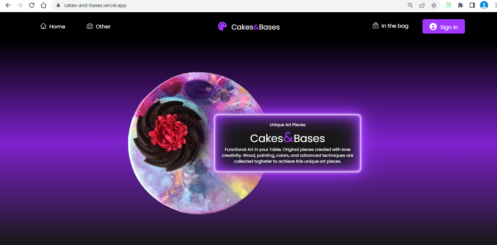

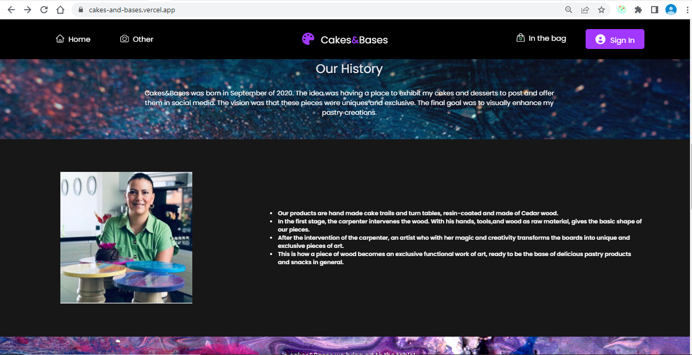

 

- Home

 

- Product detail

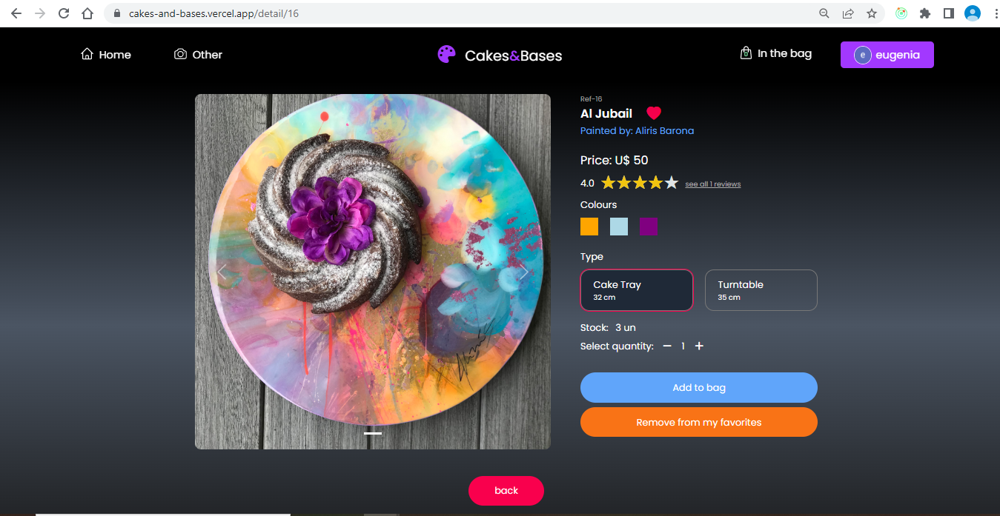

 

- Shopping cart

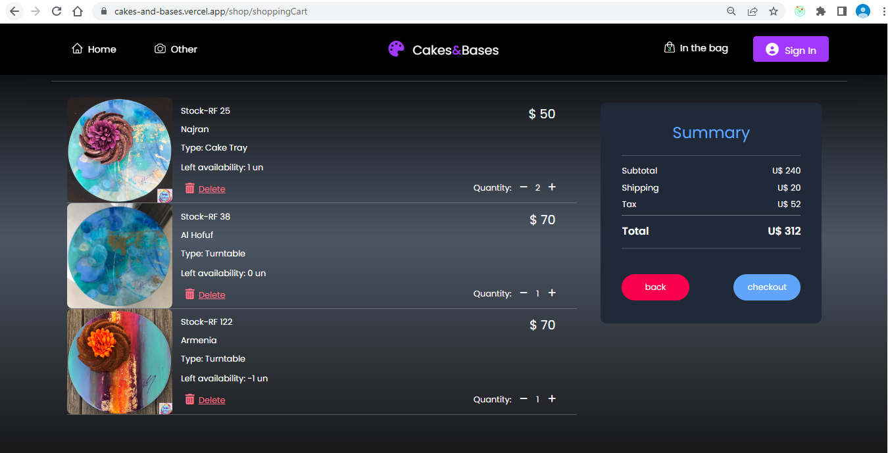

 

- Login

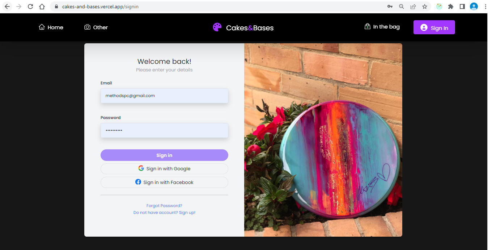

 

- Admin

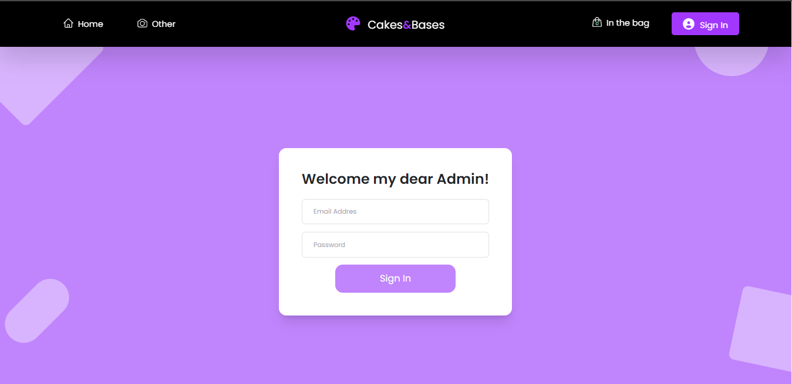

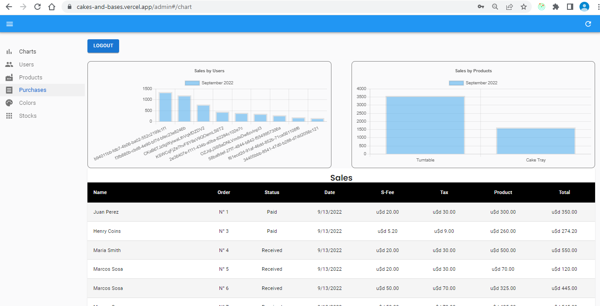

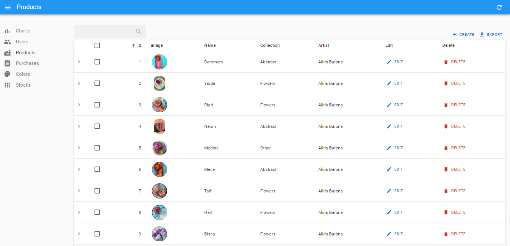

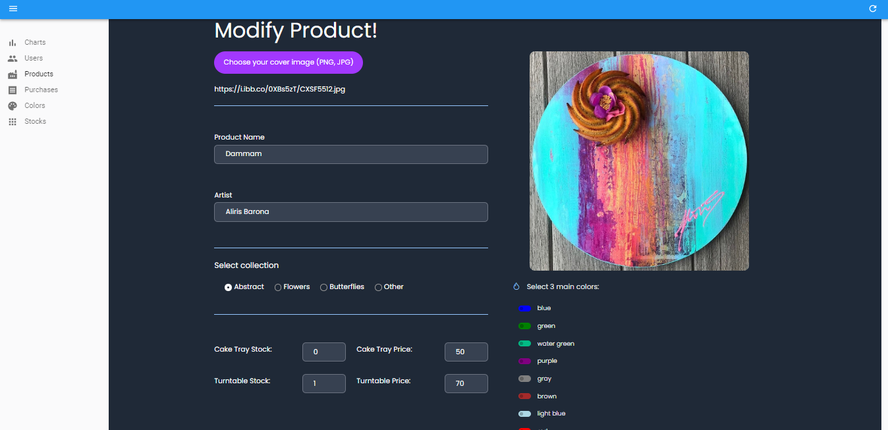

 

- Client

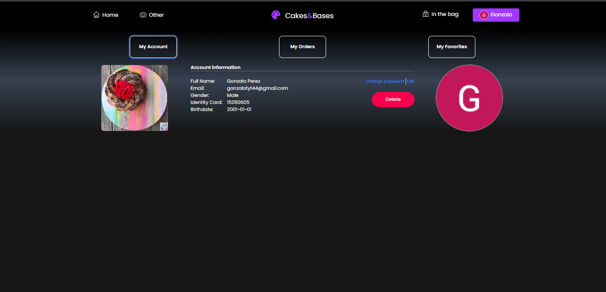

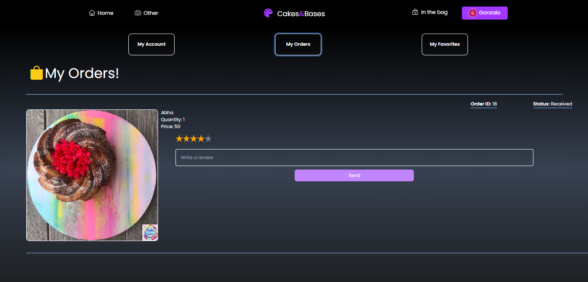

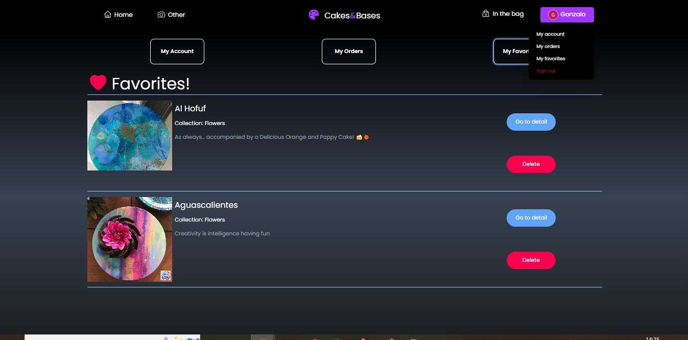

 
 

## Team

- Juan Felipe Arroyo Minotta  
https://github.com/jfarroyo291

- Gonzalo Correa  
https://github.com/Gonza10Co

- Gustavo Pagano  
https://github.com/GusPaga

- Omar Andres Ramirez Rodriguez  
https://github.com/omar5876

- Andrés Salazar  
https://github.com/andrespjm

- Matias Torres  
https://github.com/matiastorrres

- Maria Eugenia Vogt  
https://github.com/MEugeV